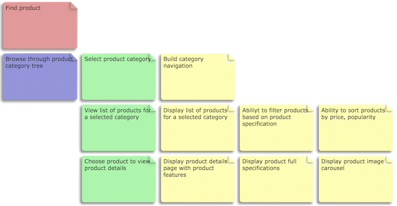
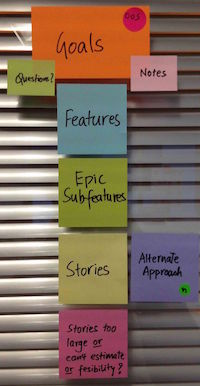

# User Story Mapping

> **tl;dr** A top-down approach to break down Goals into Activities > Tasks > Stories.

**How it [works](https://www.thoughtworks.com/insights/blog/story-mapping-visual-way-building-product-backlog)**:

Story mapping is an engaging activity where all stakeholders participate on building the product backlog on a wall (instead of a long document).

- Start with the company's vision 🌈
- A vision 🌈 is achieved via goals 🎯
- A goal 🎯 is reached by completing activities 💪
- An activity 💪 is completed after the user performs some tasks ✅
- And these tasks can be transformed into user stories for software development

[Example](https://www.thoughtworks.com/insights/blog/story-mapping-visual-way-building-product-backlog) _goal (red), activity (blue), task (green), user story (yellow)_

**How to prepare a session**:

- Book a large meeting room with empty walls
- Get coloured post-its, one for each level
- Get thick permanent markers (to read from far)
- A good camera to take photos of the wall (detail and panorama)
- Optional: stickers, like dots or stars (to flag special cases)

**Tips**:

- You can adapt the structure for user journeys 🚶‍: User > Goals > User Journeys > Actions > Stories
- Large projects may require up to 6 levels in a story map. Smaller projects, 3 levels
- Use stickers like dots or stars to represent special notations (out of scope, spikes)
- Use smaller post-its to capture assumptions, follow-ups or questions

## Author

- [Jeff Patton](https://jpattonassociates.com/blog/)

## Sources

- [Story Mapping, Visual Way of Building Product Backlog](https://www.thoughtworks.com/insights/blog/story-mapping-visual-way-building-product-backlog)
