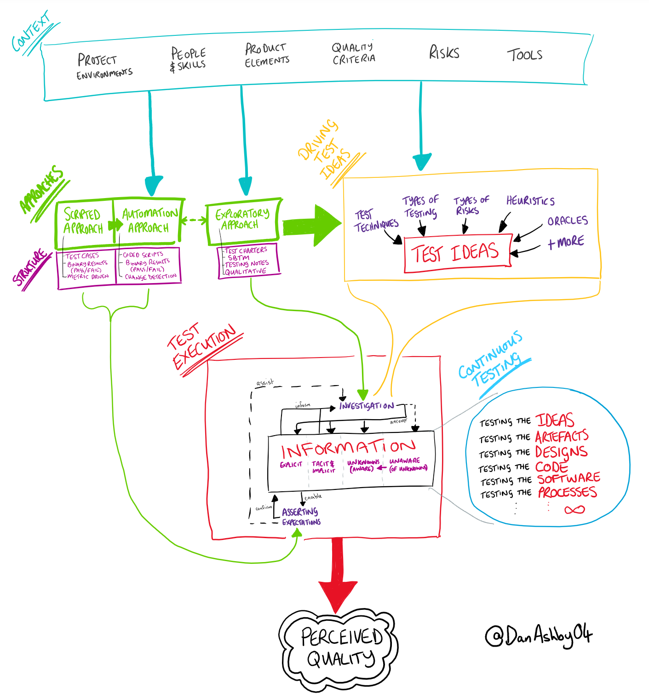

# Test strategy

> **tl;dr** Describes how your team will test and report any discoveries.

## Theory

The test strategy is defined at the start of the project and it can be revisited and reviewed during the duration of that project. It's typically created to answer the five Ws (see [**`W5H`** mnemonic](/toolbox/mnemonics.md)).

The strategy is usually driven by the testers, yet it should always include feedback from all team members:

- _Software Testers_ want to know what they might be testing over the course of the project
- _Software Developers_ want to know how they can increase [testability](/concepts/testability.md)
- _Project Managers_ want to understand how you'll test, so they can be confident in making a decision to release
- _Product Owners_ can tell you how the product is meant to be used
- _Customer Support_ can tell you how the customer uses the system, and the kind of problems they encounter
- _Sales_ can tell you which products are the most popular

> A good test strategy is a rich collage of different processes, techniques and tools.
>
> — [Mark Winteringham](https://www.mwtestconsultancy.co.uk/bdd-testing-part-4/)
>
> The test strategy is the set of ideas that guide your test process to fulfil your (testing) mission.
>
> — ["The life of one man"](https://thelifeofoneman.com/the-testing-strategy)

This strategy reveals the way tests will be designed and executed to foster quality. To do so, it needs to answer several questions like what parts of the product will be tested, what test techniques will be used, who will be involved, and how long it will take. The number of questions and the detail of the answers depends on your project's [requirements](/concepts/requirements.md), so you will have to choose between a formal and detailed document versus a simple and abridged alternative.

> Every time I look at any of the dozens of test plans my teams have written, I see dead test plans. This begs the question: if a plan isn't worth bothering to update, is it worth creating in the first place?
>
> — [James Whittaker](https://testing.googleblog.com/2011/09/10-minute-test-plan.html)

Documents are for communicating information between people. Lacking a test strategy document doesn't mean a strategy doesn't exist. Your test strategy could be a single page/slide, a mind map, or a simple checklist. Use what fits your client's needs best.

First discover **who** needs to read this document, and then ask **what** they want to know and what is the expected level of detail. In a regulated or controlled environment, such document could be mandatory, maybe even a legal requirement.

> Search for 'How to write a test plan' on the internet and there are all sorts of templates. Templates are often too generic or too specific and quickly become outdated. Once it's written, it's quite common to find out that almost no-one has actually read it.
>
> Instead, focus on selecting the best content when writing a test plan. For everything you decide to add, ask yourself: Does the reader need to know this? Is this relevant information? What else could I be doing with this time?
>
> — [Anthony Vallone (Google Testing Blog)](https://testing.googleblog.com/2016/06/the-inquiry-method-for-test-planning.html) and [Claire Reckless](https://www.ministryoftesting.com/dojo/lessons/the-one-page-test-plan)

Keep in mind that your strategy might evolve through time.

> An emergent strategy (…) emerges as assumptions get tested, constraints become concrete and context changes. This happens when you begin testing and discover a whole new set of risks and change direction to accommodate that. When working in complex, uncertain environments, when there's more questions than answers, it makes sense for teams to be aware of the emergent nature of a software testing strategy.
>
> — [Anne-Marie Charrett](https://mavericktester.com/2020/01/13/emergent-strategy/)

Similarly to [exploratory testing](/roles/exploratory-tester.md), the plan is just a foundation, you can adapt as you learn more about your context. In fact, specifying a test strategy is an effective exercise to collect information about your context, because of all the answers it demands from you. And since you have to write down that information, it's a way to organise your thoughts.

> Using a test plan as a mechanism to seek answers, to drive information consensus, and to prepare yourself, can make it worthwhile. Make it valuable for you and your stakeholders. And if you can't, don't be afraid to get rid of it.
>
> — [Richard C Paterson](https://dojo.ministryoftesting.com/lessons/how-to-write-a-software-test-plan)

## Practice

> Creating a test plan is complex. An ideal test plan is (…) a balance of implementation cost, maintenance cost, benefit, and risk.
>
> — [Anthony Vallone (Google Testing Blog)](https://testing.googleblog.com/2016/06/the-inquiry-method-for-test-planning.html)

[James Bach](https://www.satisfice.com/download/test-plan-evaluation-model) proposes a list of characteristics of a good test strategy. Keep in mind these criteria while you develop your strategy. You can also revisit them when you're finished, to check if you can improve your test strategy in any area:

- _Usefulness:_ Will the test strategy effectively serve its purpose?
- _Accuracy:_ Is it accurate with respect to any statements or facts?
- _Efficiency:_ Does it make efficient use of available resources?
- _Adaptability:_ Can it accommodate changes and unpredictability in the project?
- _Feasibility:_ Does the organization have capabilities to implement this strategy?
- _Clarity:_ Is it coherent and unambiguous?
- _Usability:_ Is the test strategy document concise, searchable and shareable?
- _Compliance:_ Does it meet externally imposed requirements?

A good starting point is the Heuristic Test Strategy Model, also from [James Bach](https://www.satisfice.com/download/heuristic-test-strategy-model). According to that plan, testing is influenced by: project environment, quality criteria, test techniques. [Dan Ashby](https://danashby.co.uk/2017/12/13/a-new-model-for-test-strategies/) then simplified that model into this intuitive diagram.

This visual representation of a possible test strategy is useful to illustrate the how different testing activities transform data into information into quality.

Now that you have an overview of a possible test strategy, it's time to fill in the details, and an effective way to do so is by asking questions. [Simon Knight](https://sjpknight.com/post/test-planning-simplified/) suggests that you keep it simple at first, using [W5H](/toolbox/mnemonics.md):

> - *Why* does it need testing? – The reason to spend time/people testing specific areas. Also risks.
> - *What* will (and won't) be tested? – The scope of your testing.
> - *How* will it be tested? – The technical details (tools, envs, data, automation, etc.)
> - *Who* will test it? – Who's responsible for what.
> - *Where* can we get information about what we are testing? – see [Oracles](/concepts/oracles.md).
> - *When* will testing start and finish? – How do we know it's complete?

Those questions cover the most critical aspects of any strategy to test your product. You can use them to generate more questions and detail your strategy even more. As the number of questions increases, we should group them into categories. [Diogo Nunes](https://www.diogonunes.com/blog/test-strategy-saddest-ppiratee-mnemonic) took [Jared Quinert](http://www.software-testing.com.au/blog/2009/07/21/thinking-about-test-strategy-a-mnemonic-device/)'s [**`GRATEDD SCRIPTS`**](/toolbox/mnemonics.md) mnemonic and further expanded it with questions from [Erik Brickarp](http://erik.brickarp.se/2016/11/test-plan-questions.html) and [Michael Bolton](https://www.developsense.com/blog/2010/11/context-free-questions-for-testing/). The result was this mind map, and a new mnemonic called [**`SADDEST PPIRATEE`**](/toolbox/mnemonics.md):

.png>)

> **Scope**
>
> - How would you describe the success of this project?
> - What is expected that we deliver?
> - What is expected that we achieve?
> - (extra)
>   - How flexible is the scope? Can we descope if needed?
>   - What are the functional requirements?
>   - What are the non-functional requirements?
>
> **Product**
>
> - What problem are we solving? For who?
> - What should our solution do? Scenarios?
> - (extra)
>   - What should our solution never do?
>   - Are there alternatives or competitors to our product?
>   - How are we expected to be different from the alternatives? Or the same?
>   - How are users expected to interact with our product?
>   - Which platforms (e.g. OS, browser) should we support?
>
> **Stakeholders**
>
> - Who has a stake on our success? And failure?
> - Who is our client? (e.g. who pays the product)
> - Who is our user? (e.g. who uses the product)
> - (extra)
>   - Any other stakeholder?
>   - What are their expectations? And concerns?
>   - Who is our team? What are their roles?
>   - Who can we trust? Who should we avoid?
>
> **Risks**
>
> - What would threaten our success?
> - What is likely to change?
> - What is still unknown?
> - (extra)
>   - Do we foresee any obstacles or pain points?
>   - How do we continuously verify we're on target?
>   - Do we have any concerns or fears?
>   - What's the worst thing that could happen? How can we avoid that?
>
> **Dependencies**
>
> - Is our delivery influenced by someone/thing outside our team?
> - Do we need to cooperate with other teams? When, how and why?
> - (extra)
>   - Do we have to comply with rules/regulations?
>
> **Approach**
>
> - How will we work together? (e.g: scrum, kanban)
> - How will we develop our product? (e.g. pairing, TDD)
> - What would a typical day look like?
> - (extra)
>   - What is our done criteria?
>   - How would we recognize a bug? (e.g. oracle)
>   - How should react when we find a bug?
>   - How do we make decisions and resolve conflicts?
>   - How can we split testing among the team?
>   - How do we handle onboarding? And handover?
>   - Any regulations or rules that influence or limit the way we work?
>
> **Prioritisation**
>
> - Who will set priorities?
> - Who reviews/approves our delivery?
> - Who perceives the quality of our delivery?
> - (extra)
>   - Quality, Cost, Time: pick two
>   - What other values are paramount?
>
> **Time**
>
> - Any important dates?
> - Any recurring events or ceremonies?
> - (extra)
>   - How much time do we have to deliver?
>   - What happens if we miss a deadline?
>
> **Architecture**
>
> - Can you draw the main components of our system?
> - How do they interact
>
> **Technologies**
>
> - Are we expected to use any specific tools/languages?
> - Which tools do we want to use to develop? And test? And deliver? And communicate?
> - (extra)
>   - What is the technological landscape where our product?
>   - What tools are we expected to build?
>   - What equipment and tools are available to support our testing?
>   - Do we have enough resources to meet the expectations?
>   - Should we use open-source? Can we pay for SaaS?
>
> **Environments**
>
> - How many do we need? For what?
> - Who will manage them? Who has access?
> - (extra)
>   - What should change to increase testability?
>   - What should change to speed up feedback?
>   - How can we create/update test data?
>
> **Data**
>
> - Which metrics are relevant to us?
> - (extra)
>   - What data should we collect about our product?
>   - What data should we collect about our approach?
>   - How do we display that data? And make it visible?
>   - Should we be notified when thresholds are crossed?
>
> **Information**
>
> - What is meaningful to test?
> - What questions should our testing answer?
> - How should those answers be reported? To who?
> - (extra)
>   - What do we need to learn more about?
>   - Where can we get information about X?
>     Who do we contact?
>   - Where do we share knowledge? How?
>   - How do we provide feedback to each other?
>   - How do we track and visualize our testing?
>
> **Experience**
>
> - Have we ever worked in a similar context?
> - What skills/experience can be found in the team?
> - (extra)
>   - Are we lacking any skills critical to our success?
>   - Who else knows something about this, inside our organisation?
>   - Who are the experts, even if outside our organisation?
>   - Which tools and techniques are useful in our context?
>
> **Emotions**
>
> - How do you feel about our product?
> - What do users feel and say about it?

If you're not sure which areas should be tested, you can do a risk mapping exercise. [Sam Connelly](https://bughuntersam.com/visual-risk-ui-automation-framework/) explains step by step how you can make one. [Diogo Nunes](https://www.diogonunes.com/blog/risk-mapping-prioritisation/) later adapted that exercise for remote teams.

## Teachers

- [Dan Ashby](https://danashby.co.uk/)
- [James Bach](https://www.satisfice.com/)
- [Michael Bolton](https://www.developsense.com)

## Sources

- [Test Plan Evaluation Model](https://www.satisfice.com/download/test-plan-evaluation-model)
- [When the rubber hits the road](https://mavericktester.com/2020/01/13/emergent-strategy/)
- [The One Page Test Plan](https://www.ministryoftesting.com/dojo/lessons/the-one-page-test-plan)
- [How To Write A Software Test Plan](https://dojo.ministryoftesting.com/lessons/how-to-write-a-software-test-plan)
- [An update to the Heuristic Test Strategy Model](https://danashby.co.uk/2017/12/13/a-new-model-for-test-strategies/)
- [Thinking about Test Strategy – A mnemonic device](http://www.software-testing.com.au/blog/2009/07/21/thinking-about-test-strategy-a-mnemonic-device/)
- [Test plan questions](http://erik.brickarp.se/2016/11/test-plan-questions.html)
- [Context-Free Questions for Testing](https://www.developsense.com/blog/2010/11/context-free-questions-for-testing/)
- [The Inquiry Method for Test Planning](https://testing.googleblog.com/2016/06/the-inquiry-method-for-test-planning.html)
- [Five Factor Testing](https://madeintandem.com/blog/five-factor-testing/)
- [A Mobile App Test Strategy](https://bughuntersam.com/a-mobile-app-test-strategy/)
- [That elusive Test Strategy](https://bughuntersam.com/that-elusive-test-strategy/)
- [Test Planning Simplified](https://sjpknight.com/post/test-planning-simplified)
